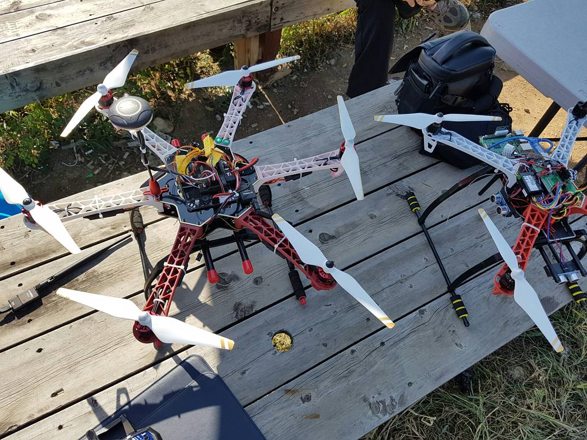

# Multiwii drone with my teacher

It is thanks to my teacher who taught me that I can study for this way.

It's a very complicated code.  But it's a project that has pushed the Arduino board to its limits.  

아두이노를 극한까지 활용한 프로젝트 입니다. 선생님과 같이 시작하고 가르침을 받으며 공부한 코드입니다.  

## model

## 참고자료

이 [사이트](http://www.multiwii.com/forum/index.php)를 참고하였습니다.  

## setting
### 변속기
일반적으로 QuadCopter를 지정하여 송/수신기에서 바인딩 작업을 한 후에 캘러브레이션을 실시합니다.  
### 송/수신기
Roll / Pithch / Yaw / Throttle 및 추가 Aux 채널을 지정할 수 있습니다.  
### 코드 수정 방법
`config.h`에 `#define`를 통해서 각종 장치 및 기능을 선언할 수 있습니다.  
